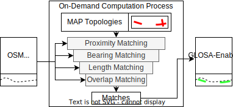
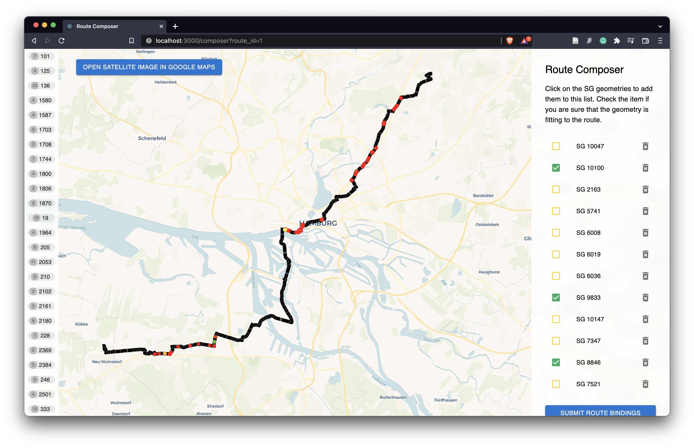

# SG Selector Library

Table of contents:

- 📚 [Introduction](#introduction) - what does this library?
- 🔧 [Quickstart](#quickstart) - how can I use this library?
- 💡 [Contributing](#contributing) - which advancements are planned and how can I help?
- 💥 [Troubleshooting](#troubleshooting) - which problems may occur?

## 📚 Introduction



With the signal group (sg) selector library, it is possible to match traffic lights to routes. This is done by matching linestring geometries (MAP topologies) of traffic lights to the route geometry. Currently, this matching is achieved using above filtering pipeline. This filtering pipeline consists of four fixed-order steps.

1. [Proximity matching](backend/backend/routing/matching/proximity.py) – Exclude all signal groups that are too far away from the route.
2. [Bearing matching](backend/backend/routing/matching/bearing.py) - Exclude all signal groups that have too much angle difference with regards to the route.
3. [Length matching](backend/backend/routing/matching/length.py) - Exclude all signal groups which can not be projected onto the route without a too big length difference.
4. [Overlap matching](backend/backend/routing/matching/overlap.py) - Under the remaining signal groups, find overlaps and decide for the better matches.

This filtering pipeline is defined as a [hypermodel](backend/backend/routing/matching/hypermodel.py) and tuned by Optuna on a training dataset. The best [configuration](backend/backend/config/topologic.hypermodel.json) is available with a RESTful API.

## 🔧 Quickstart

### 1. Build and run the development setup

Run the development setup with

```bash
docker-compose up
```

On the very first startup, this will download the base Docker images and build the containers (can take some time). 

### 2. Load example data into the database

We provide example data so that you can understand our data format and try it out for yourself. This data is inherited from the Urban Data Platform Hamburg, which uses a [FROST](https://github.com/FraunhoferIOSB/FROST-Server) API. With the running docker-compose setup, run the following command to load all data.

```bash
./load-example-data.sh
```

You may need to wait until all services are finished starting.

### 3. Send a request to the REST Endpoint at *POST* `/routing/select`

#### Request format

Select signal groups along a given route. The body of the POST request should contain a route as follows:

```
{
    "route": [
        { "lon": <longitude>, "lat": <latitude>, "alt": <altitude> },
        ...
    ]
}
```

#### Response format

Perform an example request with the example preset route:

```bash
curl --data "@examples/route_hamburg.json" http://localhost:8000/routing/select
```

Results are in the following structure:

```
{
  "waypoints": [
    {
      "lon": 9.990909,
      "lat": 53.560863,
      "alt": 9.99,
      "distanceToNextSignal": 152.0200566720922,
      "distanceOnRoute": 1234.567,
      "nextSignal": "1814"
    },
    ... [ Truncated ]
    {
      "lon": 9.978001,
      "lat": 53.564378,
      "alt": 20.22,
      "distanceToNextSignal": null,
      "nextSignal": null
    }
  ],
  "signals": [
    {
      "id": "1814",
      "geometry": {
        "type": "LineString",
        "coordinates": [
          [
            9.9901167,
            53.5614852
          ],
          [
            9.9900136,
            53.5615304
          ]
        ]
      }
    },
    ... [ Truncated ]
  ]
}
```

## 💡 Contributing

This library is available under MIT License. Contributions are welcome. Here is our current progress:

- [x] Publish usable library with our topologic feature matching pipeline
- [x] Incorporate [Python scripts](examples/scripts/generate_routes.py) for random route generation
- [x] Polish and push management commands for hypermodel [training](backend/backend/routing/management/commands/tune_metamodel.py) and [testing](backend/backend/analytics/management/commands/run_analysis.py)
- [x] Add [Route Composer](frontend) web application which is used for training dataset generation
- [x] Include experimental matching approaches ([ML-Model](backend/backend/routing/matching/experimental/features.py), [Dijkstra](backend/backend/routing/matching/experimental/dijkstra.py), [Probabilistic](backend/backend/routing/matching/experimental/markov.py))
- [ ] Advance experimental ML-based feature matching approach
- [ ] ...

### Route Composer



With the running docker-compose setup and loaded (example) routes, visit [http://localhost:3000/composer?route_id=1](http://localhost:3000/composer?route_id=1) to start picking traffic lights to routes. If you click on "submit", this will save the route bindings in the [bindings dir](examples/bindings). 

### Metamodel or ML Model Training and Testing

If you like to contribute new models, make sure to create a sufficient dataset with the Route Composer. Then, you can use the following Django management commands:

- [`tune_metamodel`](backend/backend/routing/management/commands/tune_metamodel.py) for Hyperparameter tuning with Optuna
- [`make_ml_dataset`](backend/backend/routing/management/commands/make_ml_dataset.py) for the creation of a gzipped ML feature dataset
- [`train_ml_models`](backend/backend/routing/management/commands/train_ml_models.py) for a raster search on a created ML feature dataset

### Anything unclear?

Help us improving this documentation. If you have any problems or unclarities, feel free to open an issue.

## 💥 Troubleshooting

You may have to make the entrypoint scripts executable with `chmod +x path/to/entrypoint.sh`.
